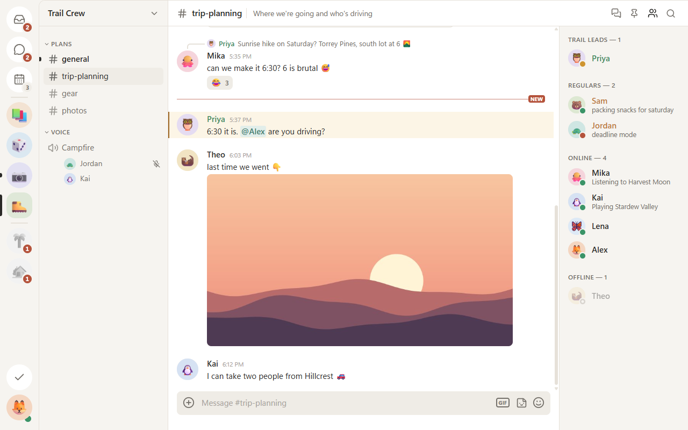
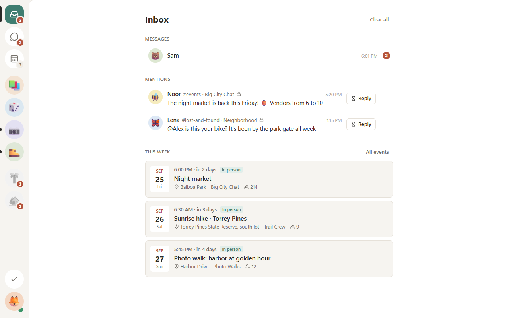
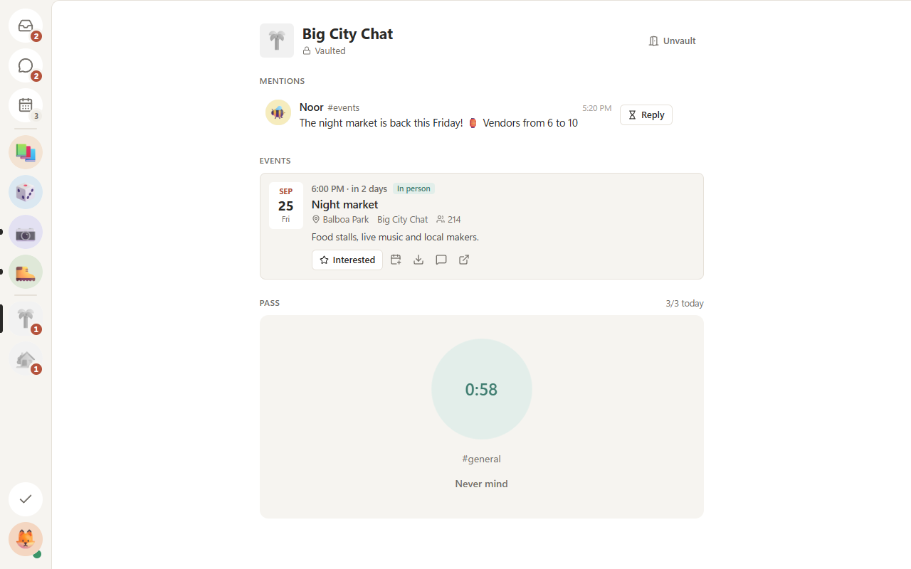
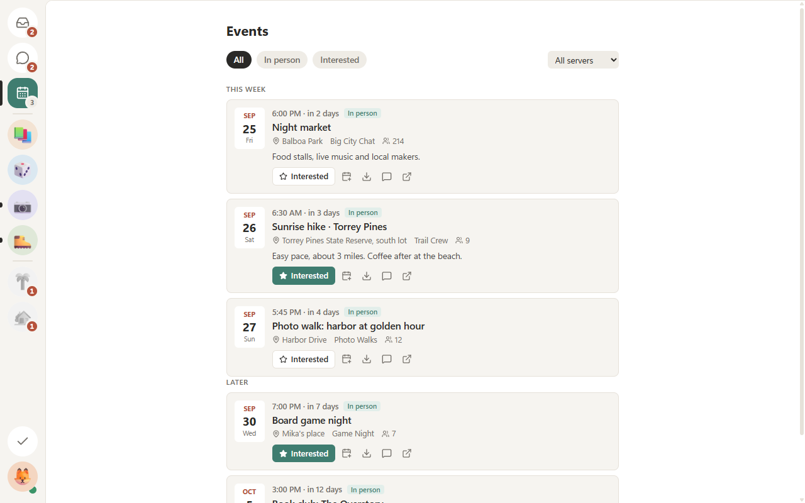
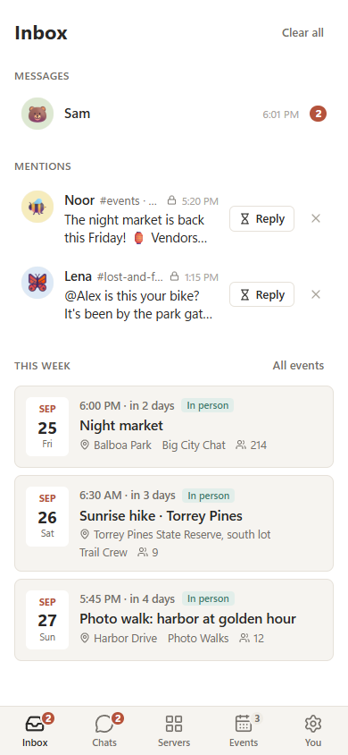
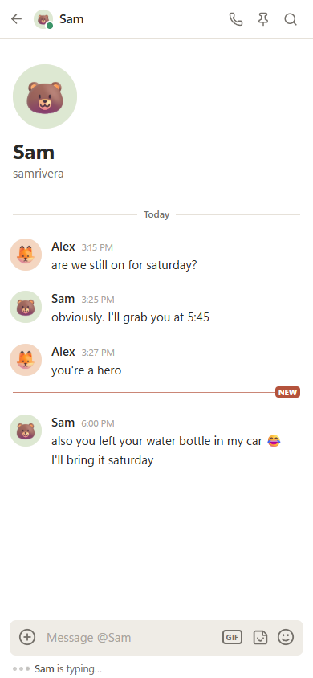

<p align="center">
  
</p>

<h1 align="center">minicord</h1>

<p align="center">
  <b>Discord, minus the scroll.</b><br>
  A calm Discord client for Windows and Android. It keeps your people and plans,<br>
  and locks away the servers you only open out of habit.
</p>

<p align="center">
  <a href="https://github.com/TylerFlar/minicord/releases/latest"><b>Download</b></a> ·
  <a href="#features">Features</a> ·
  <a href="#install">Install</a> ·
  <a href="#building-from-source">Build from source</a>
</p>

<picture>
  <source media="(prefers-color-scheme: dark)" srcset=".github/assets/server-dark.png">
  
</picture>

> [!WARNING]
> minicord is an unofficial client that signs in as you. Third-party clients break Discord's Terms of Service, and accounts can be disabled. Use it at your own risk.

## Why

Discord is where your friends are. It's also where the endless scroll is. minicord keeps the first and puts friction in front of the second.

- **Vault the servers you doomscroll.** A vaulted server has no channel list. Mentions, replies and events still reach you, and so do the channels where it posts events; everything else stays behind the lock.
- **Passes, not willpower.** Replying to a mention opens that one channel for 10 minutes. Opening a channel yourself means waiting a minute first (the wait doubles each time that day), and then it asks whether you still want in.
- **An inbox, not a feed.** The app opens on what's actually for you: unread DMs, mentions and this week's events.
- **Plans float up.** Events from every server, vaulted ones included, in one agenda with RSVP and calendar export. Events servers post in channels (Sesh cards, calendar bots, announcements with a Discord timestamp) land there too.
- **Loosening waits a day.** Vaulting a server is instant. Unvaulting it, or making passes easier, takes effect 24 hours later.

## Features

<table>
  <tr>
    <td width="50%">
      <picture>
        <source media="(prefers-color-scheme: dark)" srcset=".github/assets/inbox-dark.png">
        
      </picture>
      <p align="center"><b>Inbox</b>: what needs you, nothing else</p>
    </td>
    <td width="50%">
      <picture>
        <source media="(prefers-color-scheme: dark)" srcset=".github/assets/vault-dark.png">
        
      </picture>
      <p align="center"><b>Vault</b>: a pass waits out its pause first</p>
    </td>
  </tr>
  <tr>
    <td width="50%">
      <picture>
        <source media="(prefers-color-scheme: dark)" srcset=".github/assets/events-dark.png">
        
      </picture>
      <p align="center"><b>Events</b> from every server, vaulted ones too</p>
    </td>
    <td width="50%">
      <p align="center">
        <picture>
          <source media="(prefers-color-scheme: dark)" srcset=".github/assets/phone-inbox-dark.png">
          
        </picture>
        <picture>
          <source media="(prefers-color-scheme: dark)" srcset=".github/assets/phone-chat-dark.png">
          
        </picture>
      </p>
      <p align="center"><b>Android</b>, with its own background connection</p>
    </td>
  </tr>
</table>

Everything else works the way you know from Discord:

- DMs, group DMs, servers, threads and forums (reading and posting)
- Replies, reactions, emoji, GIF and sticker pickers, attachments (paste or drag and drop), polls, voice messages, forwards
- Slash commands and bot buttons, menus and forms
- Member list, online status, profiles, pins, search, and a quick switcher (<kbd>Ctrl</kbd>+<kbd>K</kbd>)
- Your server folder order; mutes, read state and collapsed categories stay in sync with Discord
- Calls open in Discord's own web client, so voice, video and screen share just work
- Quiet by default: GIFs don't autoplay, quiet hours hold notifications overnight, pings from vaulted servers can wait for a digest, and **Done for now** marks things read and gets out of your way

## Install

Grab the latest files from **[Releases](https://github.com/TylerFlar/minicord/releases/latest)**.

| Platform | File | Notes |
| --- | --- | --- |
| Windows 10/11 | `minicord-Setup-x.y.z.exe` | Not code-signed yet, so SmartScreen may warn you: **More info → Run anyway**. The app updates itself. |
| Android 8+ | `minicord-x.y.z.apk` | Open it on your phone and allow installs from your browser. After that, minicord updates itself: tap **Update** when a new version is out (Android asks once to allow installs from minicord). |

Sign in on Discord's own login page (captcha and 2FA work as usual). Your session stays on your device and is only ever sent to Discord.

On Android, minicord keeps its own connection in the background (third-party apps can't use Discord's push notifications). Tap the banner in the inbox to allow notifications and background running.

## How it works

- One TypeScript core (gateway, REST, a replica of your Discord state, and the vault rules) and one React UI, shared by both apps.
- The connection lives outside the UI: in Electron's main process on Windows, and in a foreground service on Android that also decides notifications while the app is closed.
- minicord presents itself as Discord's web client, and your token never enters the UI layer.
- Sign-in and calls use Discord's own web client in a window.

## Building from source

You need Node 22+ and pnpm 10. Android also needs JDK 21 and the Android SDK, with `JAVA_HOME` and `ANDROID_HOME` set.

```sh
pnpm install
pnpm dev             # desktop app with hot reload
pnpm demo            # the UI with a made-up account, no Discord needed
pnpm dist:win        # Windows installer → apps/desktop/release
pnpm android         # debug APK → apps/android/android/app/build/outputs/apk/debug
```

For development you can put a `DISCORD_TOKEN` in `.env` (see `.env.example`); unpackaged runs then sign in with it and use their own profile, separate from an installed copy.

### Tests

| Command | What it does |
| --- | --- |
| `pnpm test` | Unit tests: rules, store, gateway decoding, member lists, presence, settings protobuf |
| `pnpm test:native` | The Android runtime's tests, including the notification rules shared with the TypeScript core |
| `pnpm typecheck` | TypeScript across all packages |
| `pnpm smoke` | Read-only live check: connect, inspect READY, a few GETs, disconnect |
| `pnpm smoke:write` | Send, react, edit, reply, ack and delete in `MINICORD_TEST_CHANNEL_ID` |
| `pnpm screenshots` | Regenerate the README images from a built-in demo account (made-up people and servers) |

Live tests only write in `MINICORD_TEST_CHANNEL_ID`, which must be a channel in a server you own. The UI tours (`apps/desktop/scripts/shoot.mjs`, `apps/android/scripts/tour.mjs`) run the apps read-only unless you pass `--write`, and even then only that channel is writable.

### Releases

```sh
pnpm release 0.2.0       # or patch / minor / major: bumps every package, commits, tags
git push --follow-tags   # the Release workflow builds and publishes the installers
```

The workflow signs the APK with the key in these repository secrets: `ANDROID_KEYSTORE_BASE64` (the keystore, base64), `ANDROID_KEYSTORE_PASSWORD`, and optionally `ANDROID_KEY_ALIAS` (default `minicord`) and `ANDROID_KEY_PASSWORD`. Keep that keystore safe: Android only installs updates signed with the same key.

## Layout

```
packages/core   gateway, REST, store, vault rules, session host (platform-agnostic TypeScript)
packages/ui     React screens and the client that drives them (desktop and phone layouts)
apps/desktop    Electron shell: session in the main process, installer, auto-updates
apps/android    Capacitor shell + Kotlin runtime: background connection, notifications, updates
```

## License

[MIT](LICENSE). minicord isn't affiliated with or endorsed by Discord.
